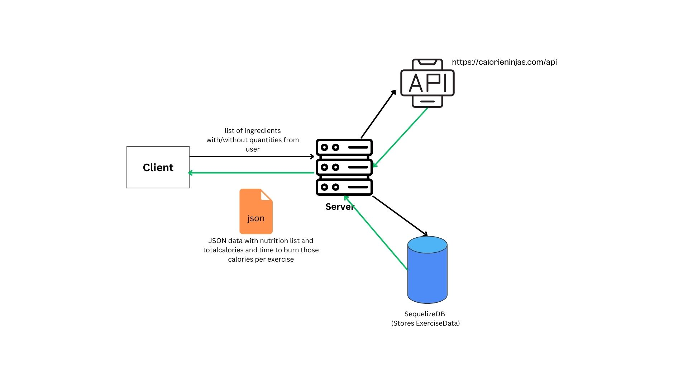

# Time-To-Burn-Server ⏲️

The backend of an app to help manage your calorie intake and burn rate.

## Introduction 🧑‍⚖️

This server application servers to provide all the data required for our Time-to-Burn app.
There are two main data sources invloved of which one is an external api that deals with retrieving data about the food ingredients,
and another local api we created that deals with possible exercises to burn off the calories.
The main goal of our aplication is giving a user information about the food they are eating, in regards to the calories it contains,
then giving them a list of possible exercises that they can do with the length of time it would take them to burn of those calories.
These calories burned for a specific time for each excersise, are an estimation based on research that was carried out.
Calculations were made to get the total amount of calories for when multiple food items were provided.
And using those total calories we were able to compare with the calorie burn rate of each exercise,
and get a final calculation of how much exercise would be needed to burn them off.

## What we did

- Using an api called [ CalorieNinjas](https://calorieninjas.com/api)(specifically the /v1/nutrition endpoint) to get the data about the food items
- Then created our own api for the exercises and created a sequelize in memory database to store the data when the server is running
- Using these two data sources we were able to make all our calculations and return the data in the form that we wanted, so that it can be consumed by the frontend.

### Architecture



## How to Run

```
npm i
```

```
cd server
npm start
```

Server runs in (https://localhost:8080)

## What could be improved in existing code

- More rigurous testing could have been done by mocking the data from the exercise API and from the external API
- Our file structure could be refactored for more effecient testing and separation of concerns

## Future extensions

- Getting more exercises data from another API call [Calories Burned API](https://api-ninjas.com/api/caloriesburned) instead of using a in memory DB
- Taking an exercise Input(user input) and calculating time for only that particular exercise
- Suggesting recipies based on the ingrediants and calculating the total calories and time to burn for that dish
